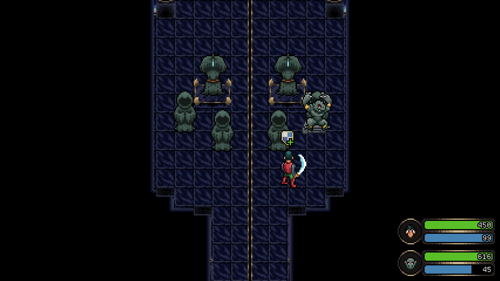
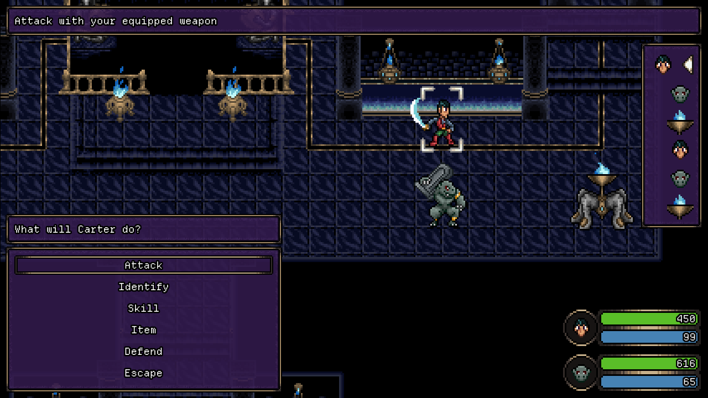

# DreamQuest: To Unknown Kadath

A 2D Eastern-styled RPG built in Godot, loosely inspired by Lovecraft's "The Dream-Quest of Unknown Kadath".

## About

I like horror books. I was reading the aforementioned "The Dream-Quest of Unknown Kadath" and thought "wow, this reads like a fetch quest", "wow, this feels like someone joined the party" and so on. And having played a number of Eastern-styled RPGs I naturally started to assign mechanics, skills and such to the characters in the story. I had some experience with Godot at the time and thought: "Wait, I *can* make this into a game!". Yes, Lovecraft is a problematic character, but since his works are now public domain, why not reclaiming them? Maybe we can even use them to send a different, better message. 

## Status

In development! Proof-of-concept release available (v0.0.1).

## Features

- Turn-based battle system
- Dialogue system (via [Dialogue Manager](https://github.com/nathanhoad/godot_dialogue_manager))
- Basic party management
- A neat cutscene system
- Basic menus for items, equipment, settings
- Rough save system

## Screenshots

## Built using:

- **Engine:** Godot 4
- **Languages:** GDScript, GDShader

## Credits
### graphics

Battle Icons, included for future use:

  [Free Assorted Icons](https://quintino-pixels.itch.io/assorted-icons)
  [Quintino Pixels](https://quintino-pixels.itch.io/)

Equipment and battle icons:

  [Ivess's Fantasy RPG Icons Pack](https://ivess.itch.io/ivess-fantasy-rpg-icon-pack)
  [Ivess](https://ivess.itch.io/)

Equipment icons:

  [Skill Icons Set](https://quintino-pixels.itch.io/free-pixel-art-skill-icons-pack)
  [Quintino Pixels](https://quintino-pixels.itch.io/)

Font used in most of the UI:

  [Departure Mono](https://departuremono.com/)
  [Helena Zhang](https://www.helenazhang.com/)

Game title font:

  [Uncial Pixel Font](https://valiegraphie.itch.io/uncial-pixel-font)
  [Valiegraphie](https://valiegraphie.itch.io)

Menu icons:

  [16x16 RPG Assets](https://ssugmi.itch.io/16x16-rpg-assets)
  [ssugmi](https://ssugmi.itch.io/)

Narration and headings font:

  [Letterstyle - font](https://wuchta.itch.io/letterstyle)
  [wuchta](https://wuchta.itch.io/)

UI Panels, Dialogue advance indicator:

  [UI assets pack 2 :)](https://srtoasty.itch.io/ui-assets-pack-2)
  [Sr.Toasty](https://srtoasty.itch.io/)

UI borders/corners included for potential future use:

  [UI borders Art Deco pixel art](https://piposchpatz.itch.io/ui-borders-art-deco-pixel-art)
  [PIPOSCHPATZ](https://piposchpatz.itch.io/)

Various UI elements:

  [Godot Pixel Interface](https://henrysoftware.itch.io/godot-pixel-interface)
  [HenrySoftware](https://henrysoftware.itch.io/)

Various projectiles, effects and tiles:

  [Remastered Tyrian Graphics](https://lostgarden.com/2007/04/05/free-game-graphics-tyrian-ships-and-tiles/)
  [Daniel Cook](https://lostgarden.com/)

### sounds

Bladed weapon sounds:

  [samurai slash](https://freesound.org/people/nekoninja/sounds/370204/)
  [nekoninja](https://freesound.org/people/nekoninja/)

Bladed weapon sounds:

  [Samurai Slash2](https://freesound.org/people/nekoninja/sounds/512785/)
  [nekoninja](https://freesound.org/people/nekoninja/)

Enemy death sound:

  [Sound Effects | SFX024](https://opengameart.org/content/sound-effects-sfx024)
  [Jesús Lastra](https://linktr.ee/jalastram)

Fanfare sound:

  [User Interface fanfare end reached success victory finished](https://freesound.org/people/jerry.berumen/sounds/772763/)
  [jerry.berumen](https://bit.ly/m/jerry-wav)

Healing sound:

  [Heart collect/Healing (Retro)](https://freesound.org/people/ReincarnatedEchoes/sounds/644306/)
  [Taiki / ReincarnatedEchoes](https://freesound.org/people/ReincarnatedEchoes/)

Healing spell sounds:

  [Cure Magic](https://opengameart.org/content/cure-magic)
  [Someoneman](https://opengameart.org/users/someoneman)

Other Gods theme:

  [JRPG Pack 3 Evil | Apocalypse](https://opengameart.org/content/jrpg-pack-3-evil)
  [Juhani Junkala](https://www.youtube.com/@subspaceaudio6850)

Prologue BGM:

  [JRPG Pack 5 Action | Army Approaching](https://opengameart.org/content/jrpg-pack-5-action)
  [Juhani Junkala](https://www.youtube.com/@subspaceaudio6850)

Tech charge sound:

  [Retro Sounds 32-Bit](https://brainzplayz.itch.io/retro-sounds-32-bit)
  [BrainzPlayz](https://brainzplayz.itch.io/)

Thymiaterion battle BGM:

  [16-Bit Fantasy & Adventure Music Pack | Decisive Battle 1 - Don't Be Afraid ](https://xdeviruchi.itch.io/16-bit-fantasy-adventure-music-pack)
  [Original music by Marllon Silva (xDeviruchi)](https://www.youtube.com/xdeviruchi)

Title screen BGM:

  [Eclipse | Aether's Dawn (Without Cello)](https://rhodyn.itch.io/eclipse)
  [Rhodyn](https://rhodyn.itch.io/)

Various battle sound effects:

  [RETRO SOUNDS](https://dagurasusk.itch.io/retrosounds)
  [DASK](https://linktr.ee/DagurasuSk)

Various battle sound effects:

  [Attack of The Enormous Mutant Badgers - Sound Effects](https://opengameart.org/content/attack-of-the-enormous-mutant-badgers-sound-effects)
  [Spring Spring](https://spring-enterprises.neocities.org/)

Various battle sound effects:

  [Classic Arcade Sound Effects](https://yourpalrob.itch.io/classic-arcade-sound-effects)
  [YourPalRob](https://yourpalrob.itch.io/)

Various battle sound effects:

  [Flatshot Complete SFX Pack](https://opengameart.org/content/flatshot-complete-sfx-pack)
  [Rosalila Studio](https://opengameart.org/users/rosalila)

Various battle sound effects:

  [200 Free SFX](https://kronbits.itch.io/freesfx)
  [KronBits](https://kronbits.itch.io/)

Various battle sound effects:

  [Patreon Menu Soundpacks](https://opengameart.org/content/patreon-menu-soundpacks)
  [MadameBerry](https://madameberry.com/)

Various battle sound effects:

  [8 Bit Sound Effects](https://opengameart.org/content/8-bit-sound-effects-2)
  [hosch/Lunar Wire](https://lunar-wire.itch.io/)

Various battle sound effects:

  [RPG Essentials SFX](https://leohpaz.itch.io/rpg-essentials-sfx-free)
  [Leohpaz](https://leohpaz.itch.io/)

Various battle sound effects:

  [Pack: 8-Bit Video Game](https://freesound.org/people/OwlStorm/packs/22895/)
  [Owlish Arts](http://www.owlisharts.com.au/)

Various battle sound effects:

  [SFX: The Ultimate 2017 16 bit Mini pack](https://opengameart.org/content/sfx-the-ultimate-2017-16-bit-mini-pack)
  [Swiss Arcade Game Entertainment](https://phoenix1291.itch.io/)

Various battle sound effects:

  [8-bit Game Sound Effects Collection](https://harvey656.itch.io/8-bit-game-sound-effects-collection)
  [harvey656](https://harvey656.itch.io/)

Various battle sound effects:

  [Sweet Sounds - A GB Studio Sound Effect Pack](https://coffeevalenbat.itch.io/sweet-sounds-sfx-pack)
  [Coffee 'Valen' Bat](https://coffeebat.neocities.org/)

Various battle sound effects:

  [The Essential Retro Video Game Sound Effects Collection [512 sounds]](https://opengameart.org/content/512-sound-effects-8-bit-style)
  [Juhani Junkala](https://www.youtube.com/@subspaceaudio6850)

Various battle sound effects:

  [Various sounds](https://freesound.org/people/colorsCrimsonTears/#sounds)
  [colorsCrimsonTears](https://freesound.org/people/colorsCrimsonTears/)

Various battle sound effects:

  [HALFTONE Sound Effects Pack LITE](https://void1gaming.itch.io/halftone-sound-effects-pack-lite)
  [VOiD1 Gaming](https://www.void1gaming.com/)

Various battle sound effects:

  [Kenney Game Assets All-in-1](https://kenney.itch.io/kenney-game-assets)
  [Kenney](http://www.kenney.nl/)

Various battle sound effects:

  [Bumper Audio Pack](https://ci.itch.io/bumper-audio-pack)
  [Chequered Ink](https://chequered.ink/)

Various battle sound effects:

  [16 Bits Monsters Growls](https://pudretediablo.itch.io/16bits-monsters-growls)
  [Diablo Luna](https://pudretediablo.itch.io/)

Various sound effects:

  [Pixel Explosions SFX Pack](https://jdsherbert.itch.io/pixel-explosions-sfx-pack)
  [JDSherbert](https://linktr.ee/JDSherbert)

Various sound effects:

  [zipChip Sound Effects Pack](https://zipdisq.itch.io/)
  [zipdisq™](https://freesound.org/people/nekoninja/)

### code

Dialogue storage and lookup:

  [Dialogue Manager](https://github.com/nathanhoad/godot_dialogue_manager)
  [Nathan Hoad and contributors](https://nathanhoad.net/)

Enemy death effect:

  [Pixel perfect dissolving](https://godotshaders.com/shader/pixel-perfect-dissolving/)
  [Markolainen](https://godotshaders.com/author/markolainen/)

Space background:

  [Pixel Space Background Generator](https://deep-fold.itch.io/space-background-generator)
  [Deep-Fold](https://deep-fold.itch.io/)

Technique for awaiting multiple signals:

  [MultiAwait](https://gist.github.com/noidexe/6fe6786d7d946d3cbdf335bcc64a8c62)
  [Lisandro Lorea](https://redmagegames.com/)

Various battle sound effects:

  [LabChirp](https://labbed.net/software/labchirp/)
  [Labbed](https://labbed.net/)

Various ideas for battles, inventory and other code structuring:

  [Godot 4 Open RPG](https://github.com/gdquest-demos/godot-open-rpg)
  [GDQuest](https://www.gdquest.com/)

